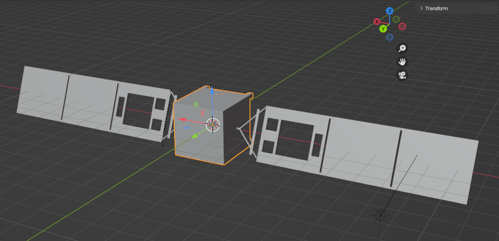
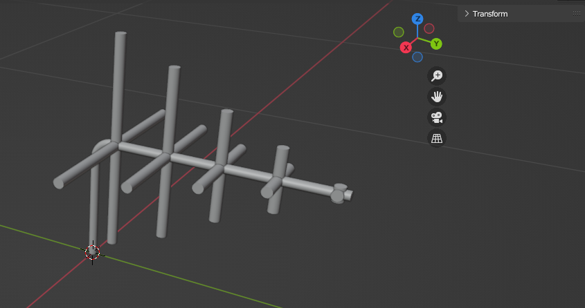

Internals
=========

RATS' internals contain files necessary to establish the RF analysis library.

Repository layout
-----------------
The repository layout is standard for a service-driven plugin.

- ``README.md`` - Documentation for RATS' Github landing page.

- ``package.json``

- ``pyproject.toml`` - Project characterization / development data

- ``build/`` - MacOS build files for RATS

- ``docs/`` - Sources for building documentation

- ``examples/`` - Sources to help demonstrate RATS functionality

- ``src/`` - The source code for RATS

  - ``rats/`` - Where the RATS code is housed.

  - ``rats.egg-info``

- ``tests/`` - Contains unit tests for each module

  - ``analysis/`` - Unit tests for the Analysis scripts (ex. line of sight, etc.)

  - ``simulation/`` - Unit tests for the simulation objects (ex. assets, etc.)

  - ``utils/`` - Unit tests for the utility codes (ex. conversions, etc.)

Package installation: PyNEC
---------------------------
RATS is highly dependendent on the PyNEC package, but installation can be tricky.
The steps listed below can be followed to properly install the correct version of
PyNEC.

- ``python3 -m pip install --upgrade pip``
- ``python3 -m pip install --upgrade setuptools``
- ``xcode-select install``
- ``python3 -m pip install pynec==1.7.3.4``

If ``python3 > import PyNEC`` does not load PyNEC, ensure PyNEC appears in the
installed package directory (``python3 -m pip list``) and crosscheck the installation
directory (``python -m pip show pynec``) against the known system path directories:

- ``python3``
- ``import sys``
- ``print(sys.path)``

Lastly, if you are running a Conda environment, you must create that environment
with the phython build from Conda Forge:

- ``conda create -n <env_name> python=3.10 -c conda-forge``

CAD Model Orientation: Assets
-----------------------------

Computer-Aided Design (CAD) models are built and attributed in Blender using
realistic, documented, validated dimensions. To ensure each CAD model is oriented
the same prior to export, the following requirements have been defined:

- The the main body of the asset is volumetrically centered at (0,0,0).
- The front face of the asset is looking down the +Y axis.
- For satellites with solar panels:
  - Solar panels should be extended along the X-axis
  - If possible, solar panels (incl. supports etc.) should be separate CAD models
  from the satellite body.
- +Z is up.

With the model oriented to these guidelines, exports should be performed using
the following settings:

- Transform scale: 1.00
- Forward: "Y Forward"
- Up: "Z Up"
- Geometry: Apply modifiers (ON)

CAD Model Orientation: Antennas
-------------------------------

Antenna models are implemented such that the main lobe of its ideal gain pattern
points along the +Y axis so that it initially radiates in the same direction that
the satellite is facing.

Furthermore, the center of the antenna (or the center of the base of the antenna)
is located at (0,0,0).

For instance, the simple dipole antenna ideally radiates in a donut pattern when
its length is 1 wavelength or less. In this case, the dipole is oriented along
the Z axis, centered at (0,0,0).

Alternatively, a turnstile (or "crossed dipole") antenna radiates orthogonal to 
the plane shared by its two dipole components. Therefore, the two dipoles would
be oriented along the X- and Z-axis respectively, with an expected main radiation
lobe along the Y-axis.

Physics calculations
----------------------
All calculations depend solely on line-of-sight (LoS) between two antennas;
without an established LoS between a transmitter (Tx) and reciever (Rx), there is
little use in calculating other physical properties (ex. atmospheric attenuation).
To enhance computational efficiency, all physical propagation calculations are
performed only for situations where LoS = 1. In all other instances, the total
recieved power is set to 0.